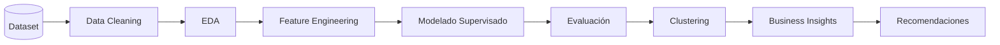

# 🏦 Bank Churn Prediction
### End-to-End Machine Learning Pipeline para la predicción del abandono de clientes bancarios

---

# 📊 Resumen del proyecto

| Indicador | Valor |
|-----------|------:|
| 📈 Tasa de Churn | **20,4 %** |
| 👥 Clientes analizados | **10.000** |
| 🤖 Modelos entrenados | **6** |
| 🏆 Mejor modelo | **Stacking Classifier** |
| 📊 ROC-AUC | **0.87** |

---

# 📑 Tabla de contenidos

- [Caso de negocio](#-caso-de-negocio)
- [Objetivos](#-objetivos)
- [Dataset](#-dataset)
- [Tecnologías utilizadas](#-tecnologías-utilizadas)
- [Metodología](#-metodología)
- [Flujo del proyecto](#-flujo-del-proyecto)
- [Desarrollo](#-desarrollo-del-proyecto)
- [Resultados](#-resultados)
- [Visualizaciones](#-visualizaciones)
- [Competencias demostradas](#-competencias-demostradas)
- [Valor agregado](#-valor-agregado)
- [Próximas mejoras](#-próximas-mejoras)
- [Autora](#-autora)

---

# 💼 Caso de negocio

La pérdida de clientes (*Customer Churn*) representa uno de los principales desafíos para las entidades financieras, ya que impacta directamente sobre el **Customer Lifetime Value (CLV)**, los costos de adquisición y la rentabilidad del negocio.

El objetivo de este proyecto consiste en desarrollar un **pipeline completo de Machine Learning** capaz de identificar clientes con alto riesgo de abandono, permitiendo anticipar acciones de retención y optimizar la toma de decisiones comerciales.

---

# 🎯 Objetivos

- Predecir la probabilidad de abandono de clientes.
- Comparar distintos algoritmos de Machine Learning.
- Identificar las variables con mayor influencia sobre el churn.
- Segmentar clientes mediante técnicas de aprendizaje no supervisado.
- Traducir los resultados en recomendaciones accionables para el negocio.

---

# 📂 Dataset

**Fuente:** Kaggle – Bank Customer Churn Dataset

**Características principales**

- 👥 Registros: **10.000 clientes**
- 📋 Variables predictoras: **10**
- 🎯 Variable objetivo: **Exited**
- 📊 Tipo de problema: **Clasificación binaria**

Variables más relevantes:

- CreditScore
- Geography
- Gender
- Age
- Tenure
- Balance
- NumOfProducts
- HasCrCard
- IsActiveMember
- EstimatedSalary

---

# 🛠 Tecnologías utilizadas

- Python
- Pandas
- NumPy
- Matplotlib
- Seaborn
- Scikit-learn
- XGBoost
- LightGBM
- CatBoost
- Git
- GitHub

---

# 🔄 Metodología

El proyecto fue desarrollado siguiendo la metodología **CRISP-DM**, recorriendo todas las etapas del ciclo de vida de un proyecto de Ciencia de Datos:

- Comprensión del negocio
- Comprensión de los datos
- Preparación de los datos
- Modelado
- Evaluación
- Comunicación de resultados

---

# 🔄 Flujo del proyecto

---

# 🚀 Desarrollo del proyecto

## 1️⃣ Exploración y preparación de datos

Se realizaron:

- Análisis Exploratorio de Datos (EDA)
- Limpieza de datos
- Tratamiento de valores faltantes
- Ingeniería de variables
- Escalado
- Codificación de variables categóricas

### Principales hallazgos

- La edad incrementa significativamente el riesgo de abandono.
- Los clientes de Alemania presentan mayor probabilidad de churn.
- Un alto balance combinado con baja actividad incrementa el riesgo.
- Los clientes activos presentan menor probabilidad de abandono.

---

## 2️⃣ Modelado supervisado

### Modelos implementados

- Logistic Regression
- Random Forest
- XGBoost
- LightGBM
- CatBoost
- Stacking Classifier

### Técnicas aplicadas

- Validación cruzada estratificada
- GridSearchCV
- Optimización de hiperparámetros
- Early Stopping
- Regularización
- Feature Importance

---

## 3️⃣ Segmentación de clientes

Se aplicó **K-Means** para identificar perfiles de clientes con diferentes características de comportamiento y riesgo de abandono.

La segmentación complementó el modelo predictivo permitiendo proponer estrategias diferenciadas de retención.

---

## 4️⃣ Consolidación y recomendaciones

Se realizó una comparación integral de los modelos considerando:

- Accuracy
- Precision
- Recall
- F1-score
- ROC-AUC
- PR-AUC
- Matriz de confusión

Finalmente se elaboró un reporte ejecutivo con recomendaciones orientadas al negocio.

---

# 📈 Resultados

| Modelo | Accuracy | ROC-AUC | PR-AUC |
|---------|---------:|---------:|---------:|
| Logistic Regression | | | |
| Random Forest | | | |
| XGBoost | | | |
| LightGBM | | | |
| CatBoost | | | |
| **Stacking Classifier** | **0.871** | **0.871** | **0.725** |

---

# 📊 Visualizaciones

## Curva ROC

> *(Agregar imagen)*

---

## Matriz de confusión

> *(Agregar imagen)*

---

## Importancia de variables

> *(Agregar imagen)*

---

# 💼 Competencias demostradas

- End-to-End Machine Learning
- Clasificación binaria
- Aprendizaje supervisado
- Aprendizaje no supervisado
- Optimización de hiperparámetros
- Validación cruzada
- Interpretabilidad de modelos
- Segmentación de clientes
- Storytelling con datos
- Traducción de métricas técnicas en decisiones de negocio

---

# ⭐ Valor agregado

✅ Desarrollo de un pipeline completo de Ciencia de Datos.

✅ Comparación de seis algoritmos de Machine Learning.

✅ Integración de modelos supervisados y no supervisados.

✅ Interpretación de resultados orientada a negocio.

✅ Aplicación de la metodología **CRISP-DM**.

✅ Elaboración de recomendaciones accionables para estrategias de retención.

---

# 🚀 Próximas mejoras

- Implementar seguimiento de experimentos con **MLflow**.
- Desplegar el modelo mediante **Streamlit**.
- Automatizar el pipeline de entrenamiento.
- Incorporar monitoreo del desempeño del modelo.
- Evaluar técnicas de Explainable AI (SHAP y LIME).

---

# 👩‍💻 Autora

**Vanina Cavallin**

Dra. en Ciencias Biológicas

**Data Scientist | Data Analyst**

📧 **Email:** vaninacavallin@gmail.com

💼 **LinkedIn:** https://linkedin.com/in/vanina-cavallin

💻 **GitHub:** https://github.com/VaninaCavallin
